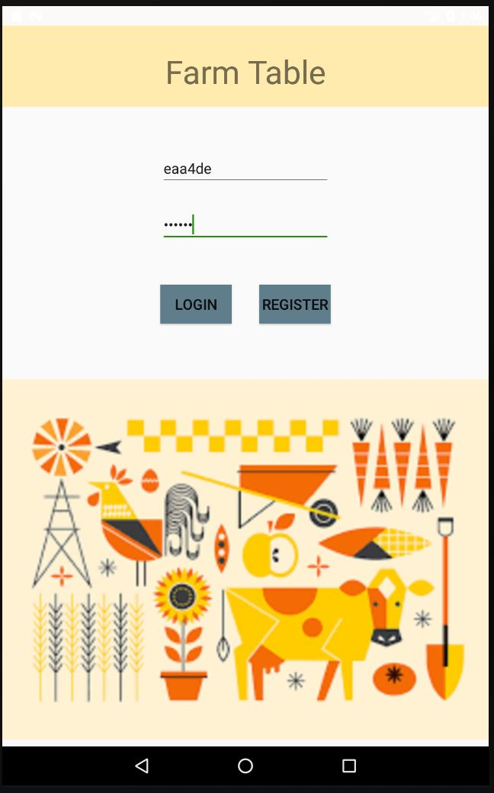
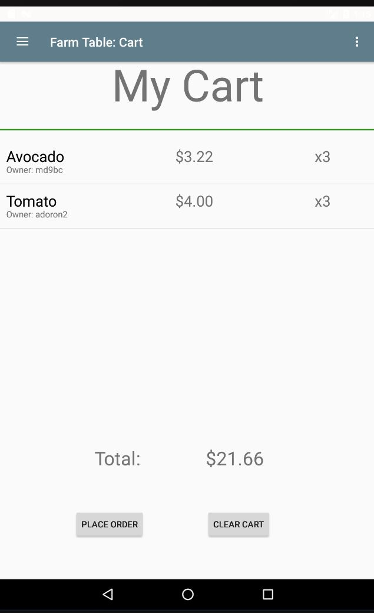
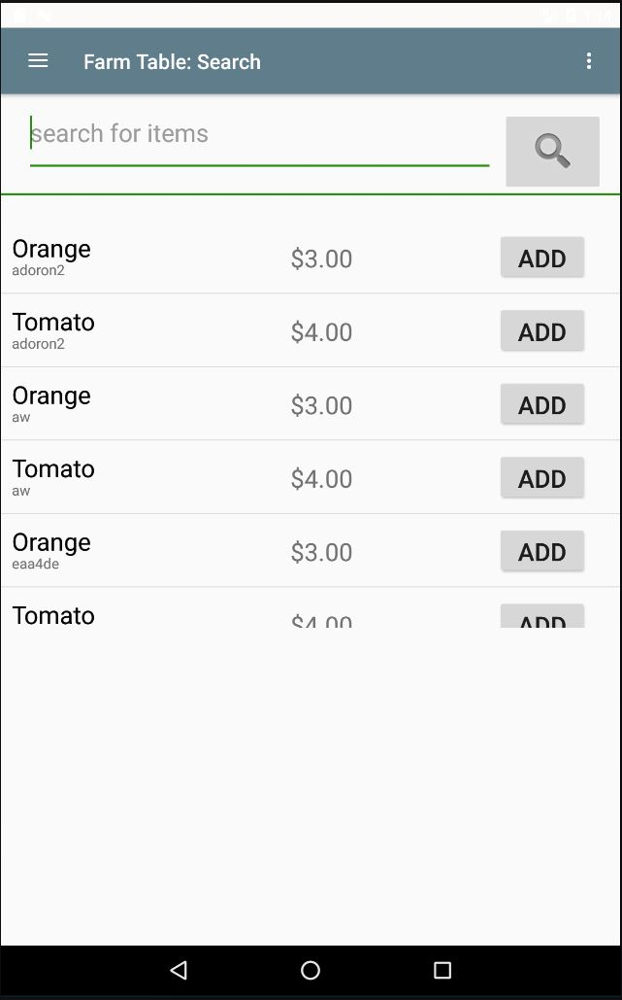
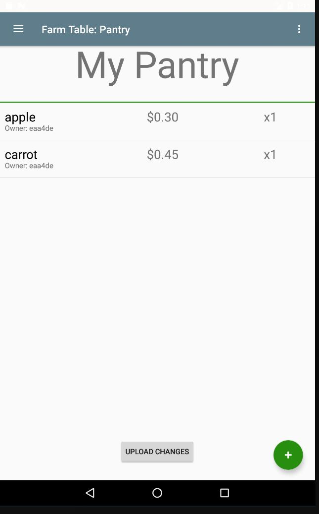
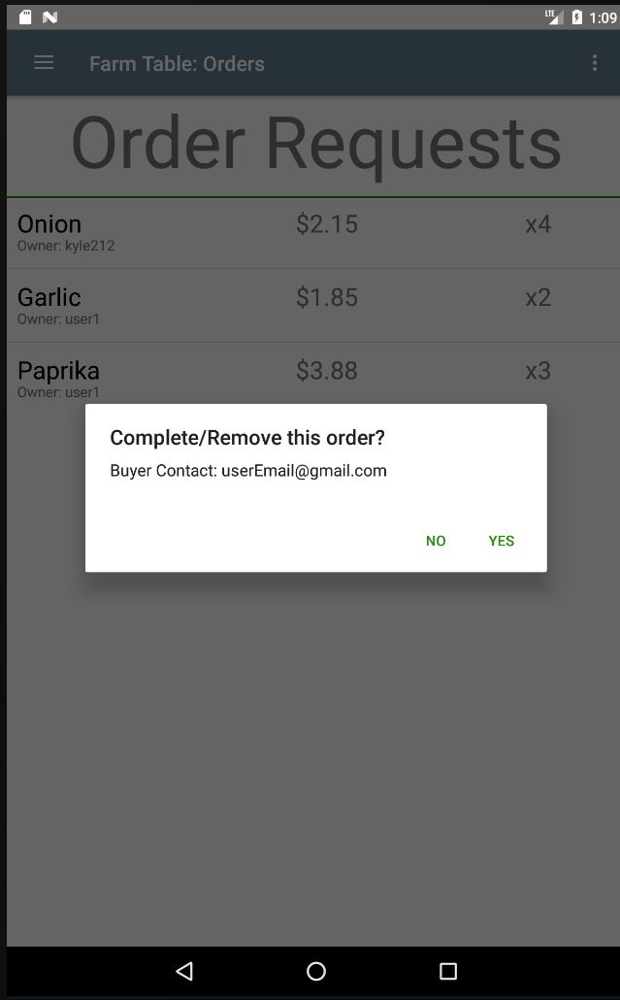
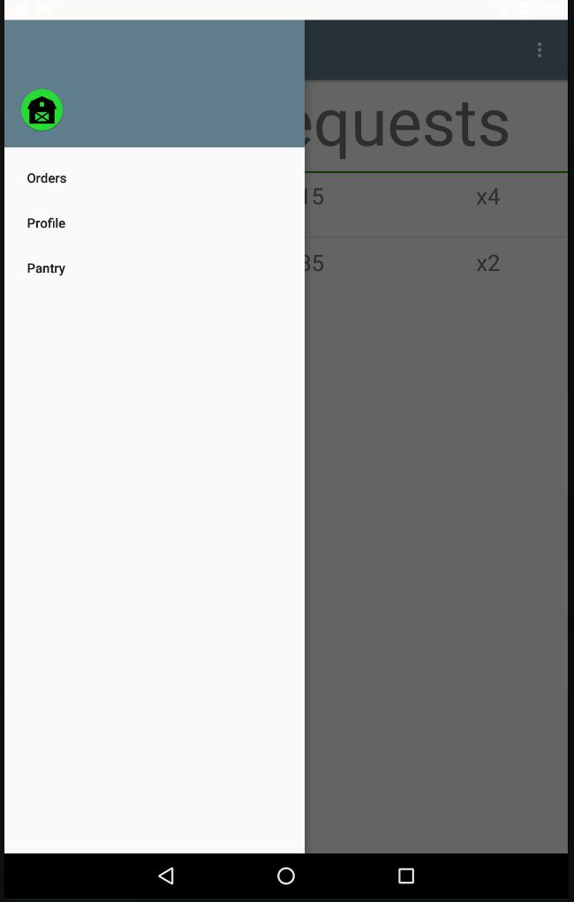

Our app, Farm Table, aims to make local, fresh food more easily accessible to communities across the country. Many communities in America struggle with food insecurity, or only have access to mass-produced, preservative-laced foods. Furthermore, even for communities that do host regular farmers markets, residents may find that items are too expensive, or that the market is held at times that they are unavailable. Farm Table intends to alleviate these issues by enabling both local farmers and residents to buy and sell foods they grow, whether it be from their farms or their personal backyard gardens, to those around them. Sellers and buyers have the freedom to meet at times convenient for them to exchange goods and payment, not strictly at times when a farmers market is open. Furthermore, without the additional cost of transportation and by enabling any resident to sell foods they grow, the items on the Farm Table app will be, on average, cheaper than those usually offered at farmers markets, and users do not need to arrange their schedules around times that a farmers market will be open. All in all, Farm Table will alleviate the issue of lack of accessibility to fresh, local foods through its online marketplace.

It is currently designed to be displayed on a large tablet screen, specifically the nexus 7 tablet. 

Login page

The cart for a user that is a buyer. 

The opening page for a buyer. Here they can search for the produce they want and add it to their cart.

The pantry for a user that is a seller. They can update this with what they currently have to sell

The order page for sellers. Here they can look at their current order requests and complete or remove them.

Navigation bar for the app, this one is for the buyers, for sellers they can navigate to their orders and their pantry instead of search and cart. 
